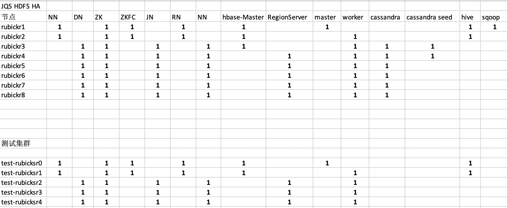

# rubick（拉比克）
## 1.简介
拉比克是一个开源大数据平台构建方案，其已稳定应用于生产大数据集群。[**戳开源地址**](https://github.com/vbay/rubick)
## 2.特点

- 可从零构建分布式存储与分布式计算。
- 融合apache大数据开源组件，特定的配置，如Hadoop、Hive、Hbase、zookeeper等，类CDH。
- 支持不同开源组件的配置文件与配置方法，可以自由添加apache基金组件。

## 3.拉比克支持的组件有

- cassandra
- hadoop(HA)
- hbase
- hive
- kafka
- spark
- sqoop2
- zookeeper

集群组件配置方案示例：
（其中1表示有该组件）

## 4.如何使用
请查看不同组件内的Readme。
